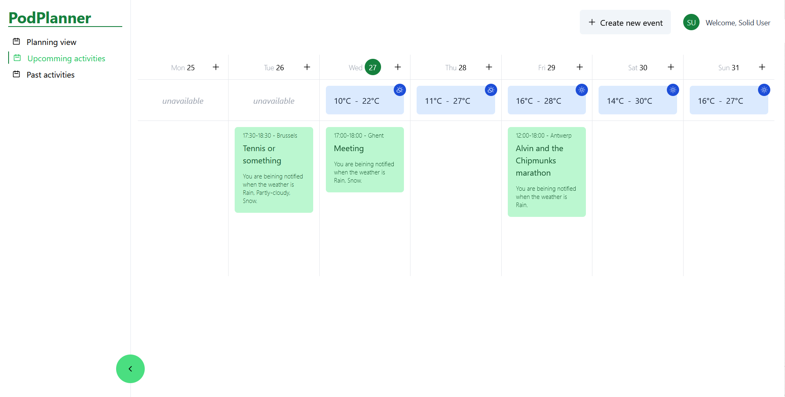

# Quick start

This project is a calendar app that uses linked data for weather info on your own calendar, all stored in your personal solid pod.

## Get a pod

Solid pods are moveable, privacy-focused, decentralised data stores.
See the [solid project website](https://solidproject.org/about) for more info on that.

Before you can use this application, you'll need a Solid pod by either...
- ... using your existing pod (if applicable).
- ... [signing up for a pod](https://solidproject.org/users/get-a-pod) from a pod provider.

    
&nbsp;&nbsp;&nbsp;... locally running our test pod.

 
    

## Use our app!

Next, all you have to do is [open our web app](https://osoc22.github.io/project-idlab/app/), and you're all set!

### Enter your Solid identity provider, and where you want the calendar to be stored

### In the upcoming view, you can see your calendar for the week, with the weather!

### Use the Create new event button to add to your calendar

### It'll immediately get added to your solid pod!

### On the side, you can navigate to different views

### The past view shows an oversight of your past activities

### While the (unimplemented) planning view showcases how the calendar could be used for planning out activities

